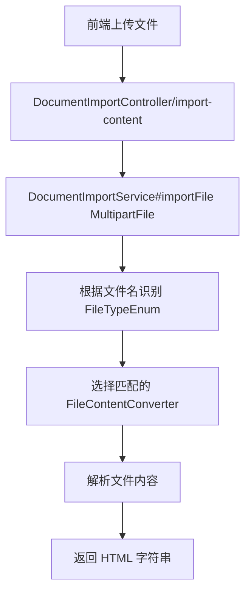
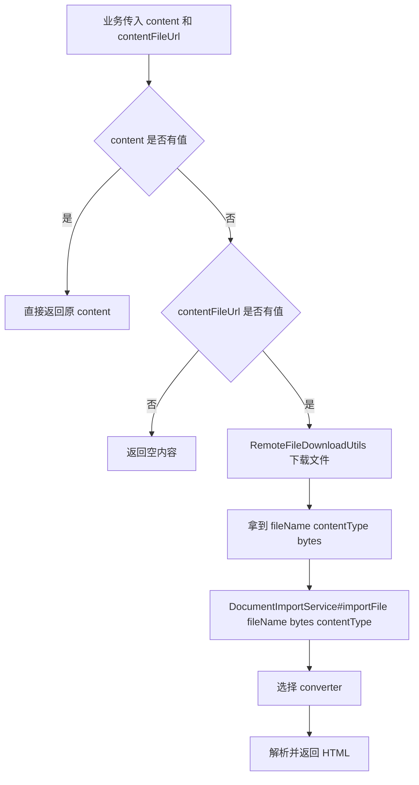

# document2html

一个用于“文档导入并转换为 HTML”的 Spring Boot 业务示例。

它解决的不是“原文件预览”，而是更偏业务落地的问题：

- 前端上传一个文档
- 或者业务数据里已经有一个文件 URL
- 后端自动识别文件类型
- 将文件内容转换成一段 HTML
- 这段 HTML 可以直接回填到富文本编辑器、正文编辑区、可编辑内容字段

如果你接手的是“正文可手工编辑，但附件里又有原始文档”的场景，这套逻辑基本就是一个可落地的最小实现。

## 1. 这套代码适合什么场景

常见业务场景：

- 用户上传 `word/pdf/excel/txt`，系统自动提取正文
- 数据库存的不是正文，而是附件 URL，需要回填成正文内容
- 发布、通知、报告、简报这类业务，需要把附件内容转成可编辑 HTML
- 后端希望屏蔽不同文档格式差异，对上层统一只暴露 `String html`

不适合的场景：

- 要求像 Office/WPS 一样高精度还原排版
- 要求完整保留图片、页眉页脚、脚注、批注、分页
- 要求把 PDF/Word 100% 无损转成前端富文本结构

这套实现追求的是：

- 统一入口
- 结构清晰
- 易扩展
- 能满足大多数“正文回填”业务

## 2. 最终效果是什么

系统最终返回的是一段 HTML 字符串，而不是复杂对象。

例如：

- `txt/doc/docx/pdf` 这类偏正文的文件，返回可编辑的富文本 HTML
- `xls/xlsx` 这类偏表格的文件，返回拼接后的 `<table>` HTML

上层业务只需要关心一件事：

```java
String html = documentImportService.importFile(...);
```

至于底层解析的是 `txt`、`docx`、`pdf` 还是 `excel`，上层不需要知道。

## 3. 支持的文件类型

当前支持：

- `txt`
- `doc`
- `docx`
- `pdf`
- `xls`
- `xlsx`

## 4. 核心调用链

这套代码有两条主要业务入口。

### 4.1 入口一：前端直接上传文件

适合场景：

- 页面上直接选文件上传
- 调试文件导入能力
- 独立测试某种文件格式解析效果

流程图：



### 4.2 入口二：业务通过 content + contentFileUrl 回填正文

适合场景：

- 数据表里正文字段可能为空
- 但附件 URL 已经存在
- 创建、编辑、提交时需要自动补正文

流程图：



这条链路的核心意义是：

- 业务层不需要自己解析文件
- 业务层不需要伪造 `MultipartFile`
- 业务层只负责决定“何时需要回填正文”

## 5. 为什么要这样分层

不同文件类型的解析方式完全不同：

- `txt` 本质上是纯文本分段
- `docx` 需要处理段落、run、表格
- `doc` 是老版 Word 二进制格式
- `pdf` 更偏文本抽取
- `xls/xlsx` 需要按 sheet/row/cell 读取

如果所有逻辑都堆在一个 service 或 controller 里，通常会出现这些问题：

- `if else` 越来越长
- 一种文件格式改动容易影响其他格式
- 不容易新增新格式
- 不容易定位 bug

所以这里采用了“统一入口 + 多 converter”的方式，也就是典型的策略模式。

## 6. 项目结构说明

```text
src/main/java/org/example/docimport
├─ controller   HTTP 接口和统一异常处理
├─ service      统一导入入口
├─ converter    各文件类型的具体解析器
├─ model        上下文、结果、枚举、请求对象
├─ util         HTML 构造、远程文件下载等工具
└─ common       通用返回结构
```

关键类说明：

- `DocumentImportController`
  暴露 HTTP 接口，接收上传文件或回填请求
- `DocumentImportService`
  统一定义导入能力入口
- `DocumentImportServiceImpl`
  负责识别文件类型、选择 converter、收口最终 HTML
- `FileContentConverter`
  所有文件解析器的统一接口
- `TxtFileContentConverter`
  解析纯文本，按空行分段为 `<p>`
- `DocFileContentConverter`
  解析 `.doc`，重点做文本提取
- `DocxFileContentConverter`
  解析 `.docx`，支持段落、基础 run 样式、表格
- `PdfFileContentConverter`
  解析 PDF 文本，不追求复杂版式还原
- `ExcelFileContentConverter`
  读取 sheet/row/cell，输出 `<table>`
- `RemoteFileDownloadUtils`
  根据 URL 下载远程文件，为“正文回填”链路服务

## 7. 各层职责边界

### controller 层

只负责：

- 接收请求
- 参数绑定
- 调 service
- 返回统一结果

不负责：

- 判断文件类型
- 解析文档格式
- 拼接 HTML 细节

### service 层

只负责：

- 统一导入入口
- 识别文件类型
- 选择匹配的 converter
- 收口返回值
- 处理 `content` 为空时按 URL 回填正文

不负责：

- 每种文件的具体解析细节

### converter 层

只负责：

- 某一种或某一类文件格式的解析

例如：

- `TxtFileContentConverter` 只关心 `txt`
- `ExcelFileContentConverter` 只关心 `xls/xlsx`

这样新增文件格式时，只需要新增 converter，而不必大改已有逻辑。

## 8. 目前每种格式大概怎么处理

### txt

处理方式：

- 按 UTF-8 读取文本
- 按空行分段
- 每段包成 `<p>`

### doc

处理方式：

- 用 Apache POI 的 `HWPFDocument` 提取段落文本
- 不追求复杂样式保留

### docx

处理方式：

- 遍历文档 body element
- 段落转成 `<p>`
- run 的加粗、斜体、下划线做基础保留
- 表格转成 HTML `<table>`

### pdf

处理方式：

- 使用 PDFBox 抽取文本
- 按空行切段
- 转成 `<p>`

限制：

- 不保证复杂布局、图文混排、表格精准恢复

### xls/xlsx

处理方式：

- 逐个 sheet 遍历
- 按 row/cell 读取显示值
- 转成 `<table>`

限制：

- 目前重点是内容，不是样式
- 合并单元格、复杂格式、颜色、边框没有精细还原

## 9. 一次完整请求在代码里怎么走

下面以上传文件为例：

1. [DocumentImportController.java](C:/Users/lhm/Desktop/document-import-demo/src/main/java/org/example/docimport/controller/DocumentImportController.java) 接收 `MultipartFile`
2. 调用 [DocumentImportService.java](C:/Users/lhm/Desktop/document-import-demo/src/main/java/org/example/docimport/service/DocumentImportService.java) 的 `importFile`
3. [DocumentImportServiceImpl.java](C:/Users/lhm/Desktop/document-import-demo/src/main/java/org/example/docimport/service/impl/DocumentImportServiceImpl.java) 根据文件名识别 [FileTypeEnum.java](C:/Users/lhm/Desktop/document-import-demo/src/main/java/org/example/docimport/model/FileTypeEnum.java)
4. `Service` 在已注入的 `FileContentConverter` 列表里找出支持当前类型的实现
5. 选中的 converter 开始解析文件
6. converter 返回 [ImportResult.java](C:/Users/lhm/Desktop/document-import-demo/src/main/java/org/example/docimport/model/ImportResult.java)
7. `Service` 将结果收口成最终 HTML 字符串
8. controller 返回给前端

## 10. 为什么 service 要保留两个 importFile 方法

### `importFile(MultipartFile file)`

适合：

- Controller 直接接收上传文件
- 最常规的接口调用方式

### `importFile(String fileName, byte[] content, String contentType)`

适合：

- 文件已经从 URL 下载到内存
- 文件来自对象存储、数据库、消息、第三方系统
- 内部业务代码不方便也不应该构造 `MultipartFile`

这个设计非常重要，因为它把“上传入口”和“文件解析能力”解耦了。

## 11. 对上层业务最有价值的地方

如果你的真实业务是“创建发布/编辑发布/提交发布”这一类流程，那么通常逻辑会变成：

1. 先看 `content` 有没有值
2. 有值就直接用
3. 没值再看 `contentFileUrl`
4. 有 URL 就下载文件并转成 HTML
5. 把 HTML 回填到正文字段
6. 最后再落库

也就是说，这套代码真正抽象出来的是：

- 业务系统不直接操作复杂文档格式
- 业务系统只消费统一的 HTML 字符串

## 12. 快速启动

环境要求：

- JDK 17
- Maven 3.9+（或任意可用 Maven 版本）

启动：

```bash
mvn spring-boot:run
```

默认端口：

```text
8088
```

配置文件：

- [application.yml](C:/Users/lhm/Desktop/document-import-demo/src/main/resources/application.yml)

## 13. 接口说明

### 13.1 上传文件转 HTML

请求：

```http
POST /api/import-content
Content-Type: multipart/form-data
```

表单参数：

- `file`: 上传的文档文件

返回：

```json
{
  "code": 0,
  "msg": "success",
  "data": "<div><p>转换后的 HTML 内容</p></div>"
}
```

### 13.2 按 content + contentFileUrl 解析正文

请求：

```http
POST /api/resolve-content
Content-Type: application/json
```

请求体：

```json
{
  "content": "",
  "contentFileUrl": "https://example.com/demo.docx"
}
```

逻辑规则：

- 如果 `content` 非空，直接返回 `content`
- 如果 `content` 为空且 `contentFileUrl` 有值，则下载文件并转 HTML
- 如果两者都空，则返回空内容

## 14. 扩展新文件格式时怎么做

假设你以后要支持 `md`、`pptx` 或其他格式，通常只需要做这几步：

1. 在 [FileTypeEnum.java](C:/Users/lhm/Desktop/document-import-demo/src/main/java/org/example/docimport/model/FileTypeEnum.java) 增加新类型
2. 新增一个 `xxxFileContentConverter`
3. 实现 `supports` 和 `convert`
4. 给类加上 `@Component`

这样 Spring 会自动注入，`DocumentImportServiceImpl` 不需要大改。

这就是当前结构最大的价值：

- 扩展点清晰
- 旧逻辑稳定
- 新逻辑容易接入

## 15. 当前实现的边界和限制

为了让业务能尽快落地，这套实现是“优先可用”，不是“优先完美还原”。

当前边界包括：

- `docx` 只保留基础文字样式，不保留全部 Office 格式能力
- `pdf` 更偏文本提取，不保证版面和表格完整恢复
- `excel` 重点保留内容，不做复杂样式还原
- 远程 URL 下载依赖目标地址可访问
- 文件类型主要按扩展名识别，不是按文件魔数做强校验

如果你的后续要求提高，可以继续往这几个方向增强：

- 增加文件头校验
- 增加图片抽取
- 增加合并单元格处理
- 增加更丰富的 `docx` 样式映射
- 增加单元测试和样例文件回归测试

## 16. 建议接手者优先阅读哪些类

如果你是第一次看这套代码，建议按下面顺序读：

1. [DocumentImportController.java](C:/Users/lhm/Desktop/document-import-demo/src/main/java/org/example/docimport/controller/DocumentImportController.java)
2. [DocumentImportServiceImpl.java](C:/Users/lhm/Desktop/document-import-demo/src/main/java/org/example/docimport/service/impl/DocumentImportServiceImpl.java)
3. [FileContentConverter.java](C:/Users/lhm/Desktop/document-import-demo/src/main/java/org/example/docimport/converter/FileContentConverter.java)
4. [DocxFileContentConverter.java](C:/Users/lhm/Desktop/document-import-demo/src/main/java/org/example/docimport/converter/DocxFileContentConverter.java)
5. [ExcelFileContentConverter.java](C:/Users/lhm/Desktop/document-import-demo/src/main/java/org/example/docimport/converter/ExcelFileContentConverter.java)
6. [RemoteFileDownloadUtils.java](C:/Users/lhm/Desktop/document-import-demo/src/main/java/org/example/docimport/util/RemoteFileDownloadUtils.java)

读完这几处，整条业务链基本就清楚了。

## 17. 一句话总结

这套代码的核心不是“会解析几种文档”，而是：

- 把不同文件格式统一收口成业务可消费的 HTML 字符串

只要抓住这一点，后面无论你要接发布模块、通知模块、报告模块，还是继续扩展更多文件格式，思路都不会乱。
